# LOVE TO RUIN — Design Document

*LOVE TO RUIN* is an anagram of *REVOLUTION*.

A Deltarune/Undertale-style RPG set in San Diego, California, starring a cast based on the Revolution friend group.

---

## 1. The big idea

**Revolution** is the team that **Eggo** and **BigJoe6** started in an attempt to beat **Hopkuna**.

The player, **Elric**, gets pulled into this conflict and decides, through how they play, whether to stand with Revolution, ignore the fight, or join Hopkuna.

## 2. The world

- **Setting:** Earth — San Diego, California.
- **Chapter 1 area:** the area around Westview High School and Mt. Carmel High School, and everything in between.

### Chapter 1 locations

| Location | Role | Notes |
|---|---|---|
| **Mt. Carmel High School** | **Starting area** · **Fragment 1** | Where Elric's journey begins and where Elric first meets Hop. Elric finds the **1st fragment** here — and picking it up is exactly what gets Eggo and BigJoe6's attention. The **tutorial fight** happens just **outside the school**. |
| **The PQ Mall** | **Main city / hub** | Where the Vons is, near the Jack in the Box and Knotty Barrel. Shops for healing items, NPCs, and cast members hanging out between adventures. A safe place — **no fragment here**. |
| **Westview High School** | **The "dungeon"** · **Fragment 2** | Chapter 1's big exploration area — the school after hours, twisted by the fragment's power into a maze of puzzles, locked rooms and enemies (like Deltarune's Dark World). The **2nd fragment** is hidden deep inside. |
| **Hilltop Park** | **REVOLUTION Corps base** · **Fragment 3** · **Chapter 1's final battle** | The Corps' base. The **3rd fragment** is buried under the **big field**. When it erupts, Hop takes the hit, Hopkuna comes out, and Chapter 1's final battle — **against Hopkuna himself** — happens on the field. The Corps returns, and the **route choice** happens. |

**Chapter 1 path:** Mt. Carmel HS → PQ Mall → Westview HS → Hilltop Park

**SAVE points** can appear anywhere as the player progresses.

### The PQ Mall (as built)

**Stores:** Vons (groceries), Games & Cards (permanently "back in 5 minutes"), Knotty Barrel (patio + salmon burgers), an empty store FOR LEASE (someone wrote "REVOLUTION HQ??" in the dust), and Jack in the Box. Vons, Jack in the Box and Knotty Barrel sell healing items for money ($).

**Who hangs out there, and what they're up to:**

| Who | Where | What happens |
|---|---|---|
| **Supreme** | Outside Vons | Rattles off stats from his seven spreadsheets; knows how the tutorial fight went. |
| **Crayola** | Outside Games & Cards | Shy; offers a card trick (Seven of Hearts). Swims with NCWethan. |
| **NCWethan** & **Ronin** | Knotty Barrel patio | The checkers running gag ("KING ME!!!" / "THAT'S CHESS."). NCWethan sparks when excited; Ronin has lost 14 in a row and got his guitar banned after "the fire alarm thing." |
| **MuffinMage** | Knotty Barrel patio | Eating a salmon burger in a fish mask. Neutral, but warns Elric about the fragment. |
| **Rooster** | Parking lot | Roasts Elric; the player can roast back ("Couldn't pick a color?" → "It's called DUALITY."). |
| **Sansworth** | Parking lot | Looking for a car he doesn't have; gives Elric a Trail Mix. |
| **Nat** | By the bench near Jack in the Box | **Lore:** the old story of twelve fragments and Hopkuna, with the last page torn out. Hop goes still. |
| **Nassan** | By the road east | **Plot:** has mapped strange reports and sends Elric to **Westview High School after dark**. Required to move on. |

## 3. The main character

**Elric** (original character) — pronouns: **they/them**

- A traveling adventurer.
- Has no home, not because of money, but because Elric never stays anywhere for long.

### Personality
- **Soft-spoken but strong-willed.**
- **Determined** in everything they do.
- **Speaks, but rarely.** When Elric does say something, it should matter.

### Appearance
- Average size.
- Gender-neutral.
- Short **brown** hair.
- Dirty, scruffy clothing (fits a life on the road) — a patched brown tunic with a rope belt and olive pants in the current sprite.
- Soft, almost pastel **purple skin**.

## 4. The cast

| Character | Notes |
|---|---|
| **Eggo** | Co-founder of Revolution. See [Eggo](#eggo) below. |
| **BigJoe6** | Co-founder of Revolution. See [BigJoe6](#bigjoe6) below. |
| **MuffinMage** | See [MuffinMage](#muffinmage) below. |
| **Nassan** | See [Nassan](#nassan) below. |
| **NCWethan** | See [NCWethan](#ncwethan) below. |
| **Sansworth** | See [Sansworth](#sansworth) below. |
| **Ronin** | See [Ronin](#ronin) below. |
| **Rooster** | See [Rooster](#rooster) below. |
| **Crayola** | See [Crayola](#crayola) below. |
| **Supreme** | See [Supreme](#supreme) below. |
| **Nat** | See [Nat](#nat) below. |
| **Hop** | A friend whose evil alter ego is Hopkuna. See [Hop](#hop) below. |
| **Hopkuna** | **The villain.** Hop's evil alter ego. Inspired by the *concept* of Sukuna from *Jujutsu Kaisen* (a malevolent being sharing someone's body), but an original character. |

### Eggo

Pronouns: any/all · Co-founder of Revolution

**Personality**
- Chill.
- Talks briefly.
- Cracks puns whenever he finds a good moment.

**Appearance** (based on his Roblox avatar — [reference image](art/reference/eggo.png))
- Yellow skin.
- Long, messy yellow hair that falls past the shoulders to the upper chest.
- A yellow beanie with **cat ears**.
- **Face:** the classic black-eyed Roblox face with a grin *(the reference picture is old and shows a different face — use the black-eyed grin instead)*.
- Black vest over a blue shirt, black pants.
- A **little bunny friend** sitting on his shoulder.

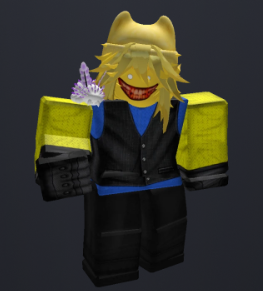

### BigJoe6

Pronouns: he/him · Co-founder of Revolution

**Personality**
- Very spirited.
- Strives for **justice and truth**.
- Also a jokester, like Eggo.

**Appearance** (based on his Roblox avatar — [reference image](art/reference/bigjoe6.png))
- Silver knight's helmet with a spiky black-and-red crest.
- Black shirt with a "777" chain necklace, white cuffs.
- Belt and blue jeans.

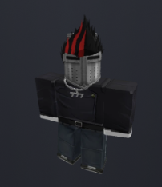

### MuffinMage

Pronouns: he/him

**Personality**
- Neutral.
- Loves **salmon burgers**.
- Talks casually, but can be serious at times.

**Appearance**
- A big red-orange **fish mask** (goldfish-style, with a wide-open mouth) covering his whole head.
- Orange shirt.
- Blue jeans.

### Nassan

Pronouns: he/him

**Personality**
- Very wise, but youthful.
- A **planner**.

**Appearance** (based on his Roblox avatar — [reference image](art/reference/nassan.png))
- Black head, face mostly in shadow.
- Black hat with white trim.
- Black shirt that says **"im batman"**.
- Light gray arms.
- Dark, patterned pants.

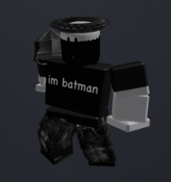

### NCWethan

Pronouns: he/him

**Personality**
- A meathead — a dunce, even — but **true to himself**, and that's all that matters.
- **Very loud.**
- A **powerhouse**.

**Powers**
- **Lightning.**

**Appearance** (based on his Roblox avatar — [reference image](art/reference/ncwethan.png))
- Classic yellow Roblox skin with a simple smiling face.
- Black helmet with yellow-tinted goggles.
- White T-shirt with a red-and-orange star/flame emblem.
- Blue pants.
- Swirling **blue rune ribbons** circling around him (could become his lightning/power effect).

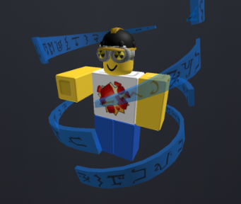

### Sansworth

Pronouns: he/him

**Personality**
- A complete **idiot**.
- The **comic relief** character.
- Still makes himself **useful**.

**Appearance** (based on his Roblox avatar — [reference image](art/reference/sansworth.png))
- White head with dark eyes and a wide, slightly unsettling smile.
- Sharp black pinstripe suit, white shirt, black tie.
- Black pants.

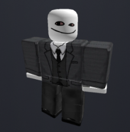

### Ronin

Pronouns: he/him

**Personality**
- **Loud** — on par with NCWethan.
- Plays **guitar**.
- Always seen **losing at checkers to NCWethan** (running gag).

**Battle role**
- **Mage.**

**Appearance** (based on his Roblox avatar — [reference image](art/reference/ronin.png))
- Wide-brimmed **red mage hat** topped with a jagged black crown that's **on fire**.
- Pale face with a frown, long dark hair.
- Red, rough-textured robe.
- One arm wrapped in **barbed wire**.
- Carries a tall, spiky black **staff with a cyan flame** at the top.

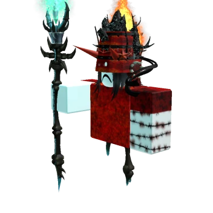

### Rooster

Pronouns: he/him

**Personality**
- A **goofball** who dogs on people for fun…
- …but gets **mad when he gets dogged on**.
- Thinks he's **better than everyone** — played as **satire**, not seriously.

**Appearance** (based on his Roblox avatar — [reference image](art/reference/rooster.png))
- Light skin, messy dark hair.
- Black top hat.
- Goofy face with his **tongue sticking out**.
- A suit split down the middle: **half white, half black**, with a black tie.

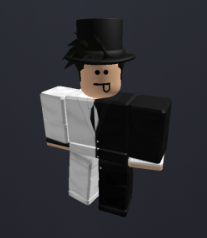

### Crayola

Pronouns: he/him

**Personality**
- **Shy.**
- Likes to play **card games**.
- **Swims with NCWethan** for fun.

**Battle role**
- **Support** character.

**Appearance** (based on his Roblox avatar — [reference image](art/reference/crayola.png))
- White head with a happy, open-mouthed smile.
- His whole torso and arms are a giant **employment / job application form**, with a small blue badge on it.
- Gray, worn pants.

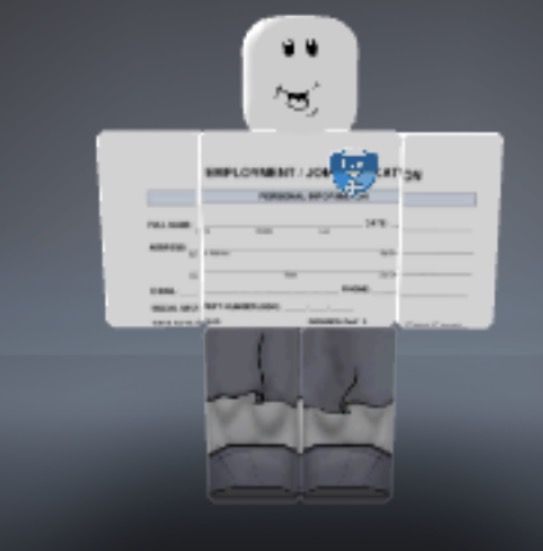

### Supreme

Pronouns: he/him

**Personality**
- A **nerd**.
- Loves to pull out **facts and statistics**.

**Appearance** (based on his Roblox avatar — [reference image](art/reference/supreme.png))
- Spiky black hair with a yellow-and-white headband/visor on top.
- Black face mask with a little bear face on it; one glowing **purple eye** visible.
- Navy striped scarf.
- Yellow long-sleeve shirt with black designs on the sleeves and a big **burger** on the front.
- Black ripped jeans.
- Green-and-white sneakers.

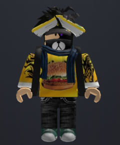

### Nat

Pronouns: he/him

**Personality**
- **Deadpan and unbothered.** Nothing rattles him; he answers chaos with a dry one-liner.
- **A bookworm who knows the past.** Where Nassan plans the future, Nat knows history — including old stories about **Hopkuna and the fragments**. He's the character who explains the lore to Elric.
- **Running gag:** the open book on his head. Everyone assumes he's studying; half the time he's actually napping under it.

**Battle idea**
- Abilities pulled from his books: "reading up" on an enemy mid-fight to unlock new ACT options or reveal how to spare them.

**Appearance** (based on his Roblox avatar — [reference image](art/reference/nat.png))
- Dark skin, calm half-lidded eyes.
- An **open book resting on his head** like a little roof.
- **Purple** shirt.
- Black arms and pants.

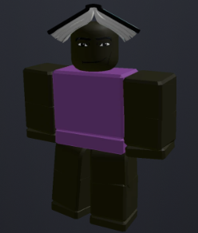

### Hop

Pronouns: he/him

**Personality**
- Very athletic.
- Sarcastic — a jokester.

**Appearance** (based on his Roblox avatar — [reference image](art/reference/hop.png))
- Black fedora.
- Gray, blocky head with an angry, gritted-teeth grin.
- Dark gray shirt with lighter gray arms.
- Blue-gray pants.

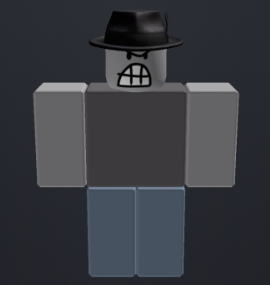

### Hopkuna

Pronouns: he/him

**Who he is**
- An entity of **pure evil** who wants to **watch the entire world burn**.
- That includes **Elric** — but Elric doesn't know that. *(Even on the genocide route, Hopkuna plans to turn on Elric eventually.)*

**What he wants**
- Hopkuna needs **the fragments**: without their power, he can't continue his plan.

**How Hop and Hopkuna are connected**
- **Hop knows Hopkuna exists.**
- Hop treats Hopkuna as a **last resort**, and only lets him out when Hop is **genuinely in danger**.
- **Once Hopkuna has 12 fragments, he takes over** (for good).

**The fragments**
- There are **exactly 12** fragments in total — Hopkuna needs **every single one**.
- Every fragment the player finds is one step closer to disaster (or, on the pacifist route, one more to destroy).

**Appearance**
- Same body as Hop.
- **Very specific tattoos all over his body** (designs to be decided).
- A **light red tint** over his whole body.

## 5. Battles

- **Team battles like Deltarune:** up to **3** party members fight at once.
- **Elric chooses the team:** Elric plus 2 cast members of the player's choice.
- **The whole cast is available** — every character can be a party member, so the player can mix and match for unique team-ups and dialogue.
- **EXP without violence:** on the pacifist route, you gain EXP by doing other things, so you can grow strong without hurting anyone.

### Two ways to grow: LOVE and BOND

| Stat | Stands for | Grows from | Route |
|---|---|---|---|
| **LV (LOVE)** | **L**evel **O**f **V**iolenc**E** (as in Undertale) | Defeating and killing enemies | Genocide |
| **BOND** | **B**ound by **O**ur **N**ew **D**etermination | **Sparing enemies** (ACT/MERCY — harder spares give more) and **bonding with the cast** (hanging out, talking, making choices with Revolution members) | Pacifist |

- Both stats make Elric stronger, but in different ways.
- The player can tell which path they're on just by looking at their stats.
- Ties into the title: **LOVE** to ruin, **BOND** to save.
- **The meaning of BOND is kept secret** (like LOVE in Undertale) and revealed near the end of the pacifist route: *"BOND. Bound by Our New Determination."*
- **SAVE points and resets** work like in Undertale/Deltarune.
- **DETERMINATION** exists in this world.

## 6. Story outline

### Beginning
Elric is a traveling adventurer with no fixed home.

#### Chapter 1 opening — how Elric meets the cast
1. **Hop first.** Elric arrives in the area and meets **Hop** before anyone else. Hop seems friendly, if a little strange, and the two become friends. The player has no idea that Hop and Hopkuna are the same person.
2. **The first fragment.** Elric picks up one of Hopkuna's fragments.
3. **Mistaken for an enemy.** **Eggo** and **BigJoe6** catch Elric holding the fragment, assume Elric works for Hopkuna, and attack. This is the **tutorial fight** (see below).
4. **The reveal at the Chapter 1 climax.** Hop gets into **genuine danger**, and as a last resort, **Hopkuna comes out for the first time** — right in front of Elric. The friendship built over Chapter 1 makes the twist hit hard.
   - **The 3rd fragment erupts:** when Elric and Hop uncover it under the big field, its unstable power lashes out — straight at Elric.
   - **Hop takes the hit:** **Hop jumps in front of it** and is badly hurt.
   - **Hopkuna erupts:** tattoos spread and the red tint washes over Hop's body. Hopkuna came out to save Hop's body — and, technically, **Elric's life**.
   - **The boss is Hopkuna himself:** then Hopkuna turns on Elric. **Chapter 1's final battle is against Hopkuna** on the big field — a fight Elric can't truly win, only survive.
   - **The Corps arrives** and drives Hopkuna back; Hop returns to normal. Elric is still shaken when the Corps asks the big question.
5. **The route choice ends Chapter 1.** Right after the reveal, the full **REVOLUTION Corps** finds Elric and asks what Elric wants to do (see [The route choice](#the-route-choice)). The player knows exactly what "Go with Hop" means. Chapters 2–4 play out differently depending on the answer.

#### The tutorial fight: Eggo & BigJoe6 *(proposed — open to changes)*

This fight **teaches every core mechanic**, one at a time, through the characters' own dialogue instead of pop-up text boxes.

| Turn | What happens | Mechanic taught |
|---|---|---|
| **Start** | BigJoe6 charges in: "Hand over the fragment, Hopkuna's lackey!" | The battle screen, party HP |
| **1** | BigJoe6 attacks first. The SOUL appears in the box. | **Dodging** with the SOUL |
| **2** | Hop: "Don't just stand there — hit 'em!" | **FIGHT** (the timing bar) |
| **3** | Eggo, unbothered: "...you could also just talk to us." | **ACT** — starting with **CHECK** (enemy stats) |
| **4** | Elric can ACT on each enemy: tell Eggo a pun (he can't resist), tell BigJoe6 the truth (he values justice and truth). | **Character-specific ACTs** |
| **5** | Hop takes his own turn and acts alongside Elric. | **Team turns** (party members act too) |
| **6** | Elric takes a big hit; Hop tosses over a snack. | **ITEM** and **DEFEND** |
| **7** | Eggo and BigJoe6's names turn yellow. | **MERCY / SPARE** — sparing earns **BOND** |

- **Two ways out:** the player can SPARE them (earns BOND) or FIGHT them down (earns LOVE). Either way, they're only **knocked out, not killed** — it's a tutorial, and both survive to become part of the cast.
- **Hop fights alongside Elric** as a temporary party member — which makes his later reveal hurt more.
### Middle
Elric meets the cast and recognizes the villain, **Hopkuna**. Elric works and travels the lands in search of **Hopkuna's fragments**.

#### What Elric is searching for
- **The surface goal — Hopkuna's fragments.** Pieces of Hopkuna's power are scattered across San Diego (similar in concept to Sukuna's fingers in *JJK*). Revolution wants them destroyed, Hopkuna wants them back, and Elric collects them. They give the player a clear goal and a reason to explore every corner of the map.
- **The real goal — a home.** Elric has always wandered without knowing why. What Elric is truly looking for is a place to belong.

How it pays off on each route:

| Route | The fragments | A home |
|---|---|---|
| **Pacifist** | Destroyed with Revolution to free Hop. | The cast becomes Elric's home. |
| **Neutral** | Kept, or ignored in favor of exploring. | Elric keeps wandering. |
| **Genocide** | Given to Hopkuna, making him unstoppable. | Elric destroys any chance of having one. |

### The route choice
When Elric **meets the REVOLUTION Corps**, they ask what Elric wants to do, and Elric must **manually choose a route**:

> **Go with Hop?** *(Genocide)*
> **Chart your own path?** *(Neutral)*
> **Join the REVOLUTION Corps?** *(Pacifist)*

What each choice locks:

| Choice | Result | Pacifist later? | Genocide later? | Neutral later? |
|---|---|---|---|---|
| **Go with Hop** | The Corps kicks Elric out. | 🔒 Locked | — | 🔒 Locked |
| **Chart your own path** | The Corps offers Elric the chance to come back and join them later. | ✅ Still open | 🔒 Locked | — |
| **Join the REVOLUTION Corps** | Elric joins the team. | — | 🔒 Locked | 🔒 Locked |

So Neutral is the only choice that can still change, and only toward Pacifist.

### Endings — decided by the route choice and how the player plays

| Route | Elric's choice | Notes |
|---|---|---|
| **Pacifist** | Band together with the cast to defeat Hopkuna. | EXP comes from non-violent actions. |
| **Neutral** | Do nothing; keep expanding and exploring the world. | |
| **Genocide** | Join Hopkuna. | The player must kill everyone. |

## 7. Size

- **4 chapters**, with **3 fragments each** (12 total).

| Chapter | Fragments | Area |
|---|---|---|
| **1** | 3 (fragments 1–3) | Westview High School ↔ Mt. Carmel High School and everything in between |
| **2** | 3 (fragments 4–6) | *to be decided* |
| **3** | 3 (fragments 7–9) | *to be decided* |
| **4** | 3 (fragments 10–12) | *to be decided* |

- Each chapter expands the world, like Deltarune.

## 8. Build order — Chapter 1

Build the game in **milestones**. Each one ends with something playable, so progress is always visible.

### Milestone 1 — The tutorial fight (battle system)
Use the Eggo & BigJoe6 fight as the target: when it plays start to finish, the battle system works.
- [x] Battle box and SOUL movement
- [x] Enemy attacks (bullets) and taking damage / HP
- [x] Battle menu: **FIGHT · ACT · ITEM · MERCY** (+ DEFEND)
- [x] FIGHT timing bar
- [x] ACT options and CHECK
- [x] Sparing (names turn yellow) → **BOND**; defeating → **LOVE** (EXP)
- [x] Party turns (Elric + Hop)
- [x] The full tutorial fight, scripted turn by turn
- [x] Pixel-art battle sprites for Eggo, BigJoe6, Elric and Hop (`art/sprites/`, drawn by `tools/make_sprites.ps1`)
- [x] Sound effects (generated in code by `scripts/sfx.gd`)
- [ ] Pixel font *(needs a download — waiting for approval)*
- [x] Music: 7 original chiptune tracks (title, Mt. Carmel, PQ Mall, Westview, battle, boss, GAME OVER), composed as note lists in `tools/make_music.gd` and crossfaded between areas
- [x] A proper GAME OVER screen (the SOUL cracks and shatters, "Stay determined...")

### Milestone 2 — Talking
- [x] Dialogue box with letter-by-letter text and voice beeps (each speaker has their own pitch and name tag)
- [x] Character portraits (head-and-shoulders from each sprite)
- [x] Facial expressions in portraits: happy, angry, sad, shocked, smug (`art/portraits/`, made by `tools/make_sprites.ps1`). MuffinMage and Supreme use their normal face (their masks cover it).
- [x] Dialogue choices (Yes / No, Save / Return)

### Milestone 3 — Walking around
- [x] Elric's overworld movement and animation (front/back sprites, walking bounce)
- [x] Walls / collision and the camera
- [x] Talking to characters and inspecting objects
- [x] Followers (Hop walks behind Elric)
- [x] Side-view walking sprites with a 2-frame walk (Elric, Hop, Eggo, BigJoe6)
- [x] Moving between areas (Mt. Carmel ↔ PQ Mall)

### Milestone 4 — The opening (first playable demo)
- [x] Title screen: **REVOLUTION** rearranges into **LOVE TO RUIN**
- [x] Opening narration
- [x] Mt. Carmel High School area (school, parking lot, courtyard, field, road)
- [x] Meeting Hop
- [x] Finding fragment 1
- [x] Tutorial fight outside Mt. Carmel, with different reactions for sparing / fighting
- [x] **SAVE points** and save/load (Continue on the title screen)
- [x] "To be continued" screen when leaving toward the PQ Mall

### Milestone 5 — The PQ Mall hub
- [x] Shops and items (money, 8-item bag)
- [x] NPCs and cast members to talk to (9 cast members with sprites, portraits and dialogue)
- [x] Nat's lore and Nassan pointing the way to Westview
- [ ] Party selection (Elric + 2 of the cast) — *needs decisions: see Open questions*

### Battle polish (from feedback)
- [x] Several attacks per enemy, a different one each turn (Eggo: rain, egg drop, bunny hop · BigJoe6: lance, sweeping wall, aimed stars)
- [x] "Ready?" check after choosing, with X to go back and change anything
- [x] On-screen control hints in menus

### Milestone 6 — Westview High School
- [x] The twisted school dungeon: rooms, puzzles, enemies
- [x] Fragment 2

**As built:** Elric and Hop sneak in after midnight (party is just Elric + Hop for now).
- **Outside** — the school at night, SAVE point, front doors that creak open on their own.
- **The endless hallway** — walking to the far end loops you back to the start; a poster gets more frantic each loop ("NO RUNNING" → "TURN BACK" → "TURN BACK!!" → "YOU'VE BEEN HERE"). Opening the **humming locker** breaks the loop.
- **The classroom** — the chalkboard says to ring the bells **3rd, then 1st, then 2nd**; a wrong bell buzzes and resets. Solving it unlocks the gym.
- **The gym** — SAVE point, then **Wally Wolverine**, Westview's mascot (he/him): an empty costume brought to life by fragment 2. Look: brown furry wolverine, darker markings around yellow-green eyes, tan snout and belly, black nose, fangs, big clawed paws. Attacks: confetti, claw swipe (three diagonal claw marks flash, then slash), claw drop (sets of three claws plunge from the top), red dodgeballs (from the sides and the top, each bouncing to its own height), giant foam finger. ACTs: Cheer ("GO WOLVERINES!"), Look Inside, Paw Five.
- **Wandering enemies** you bump into: **Pop Quiz** (hallway; pencils, answer bubbles; ACT: Answer, Study) and **Hall Pass** (classroom; fluttering passes, dashing zoom; ACT: Sign It, Ask Directions).
- **Afterwards** — fragment 2 rolls out of Wally's costume. Hop reaches for it, his shadow looks *wrong* for a moment, and he slips: *"Two down, huh?"* Elric asks if he's okay. The emergency exit leads on toward Hilltop Park.

### Milestone 7 — Hilltop Park and the climax
- [x] The 3rd fragment erupts → Hop takes the hit → Hopkuna erupts (cutscene)
- [x] The final battle against **Hopkuna** on the big field
- [x] The REVOLUTION Corps arrives
- [x] **The route choice** — end of Chapter 1

**As built:**
- **Hilltop Park at night** — the big field, the Corps' picnic shelter with a hand-painted REVOLUTION banner, and a map with twelve red circles (two crossed out, a third on this very field). SAVE point. Music: "Hilltop at Night."
- **The eruption** — walking toward the glow, the fragment fires at Elric. Hop shoves in front of it ("ELRIC, MOVE!!"), takes the blast, begs Elric to get away, and Hopkuna takes over: tattoos, red tint, glowing red eyes. *"...Finally."* He wants the two fragments Elric carries. Elric: *"...No."*
- **Hopkuna (survive, don't win)** — Elric fights **alone**. Hopkuna can't be spared or meaningfully hurt ("It barely leaves a mark."). Survive **5 enemy turns**. Attacks: Cleave, Slash Grid, Red Arrows, Burst (all with warnings). ACTs: Talk to Hop, Stand Firm. Music: "Hopkuna."
- **The Corps arrives** — BigJoe6, Eggo, Nassan, Nat, NCWethan, Ronin, Supreme, Crayola and Rooster surround Hopkuna ("LIGHTNING TIME!!!" / "FIRE TIME!!!"). Elric speaks to Hop ("Come back."). Hopkuna lets go — *"Three fragments, little wanderer. Nine to go. I can wait."* — and Hop collapses, then explains: he only ever let Hopkuna out when there was no other choice. Elric picks up **fragment 3**.
- **The route choice** (with an "Are you sure?" confirm):

| Choice | What happens | Locks |
|---|---|---|
| **Join the REVOLUTION Corps? (Pacifist)** | Elric joins; NCWethan's group hug; "You saved me. We'll save you." The Corps resolves to destroy the fragments. | Genocide, Neutral |
| **Chart your own path? (Neutral)** | Elric walks away alone; the Corps' offer stays open; Hop stays with the Corps. | Genocide |
| **Go with Hop? (Genocide)** | The Corps throws Elric out ("GET OUT."); Elric and Hop walk into the dark. *"Good choice, little wanderer."* | Pacifist, Neutral |

- The game saves the choice, then shows **CHAPTER 1 COMPLETE** with the route.

### Throughout
- Pixel-art sprites for Elric and the cast (from the [reference images](art/reference/))
- Music and sound effects
- Saving progress to GitHub after every working step

---

## Open questions

- Exactly how much BOND each action gives, and what BOND improves vs. what LV improves.
- When does each character become available to join the party? Hop is with Elric for all of Chapter 1 (the story needs him there for the climax) — so does party selection start in Chapter 1 with Hop locked in, or after the route choice?
- Each cast member's battle abilities (ideas so far: Supreme = super CHECK, Crayola = support cards, NCWethan = lightning, Ronin = fire/guitar magic, Nat = "reading up" to unlock ACTs, Nassan = strategy, Rooster = roasts).
- Where do Chapters 2–4 take place?
- What do Hopkuna's tattoos look like?
- What are each character's personality and battle abilities?
